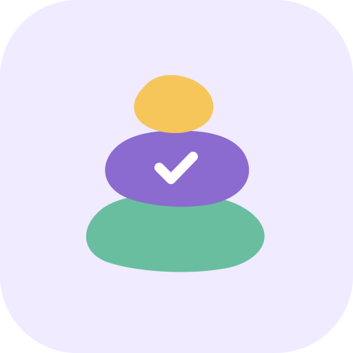
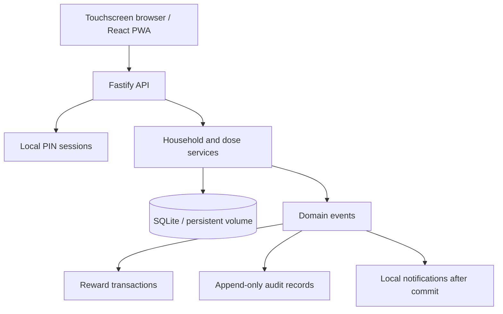

# PebbleDose



[](https://github.com/BytesNation/PebbleDose/actions/workflows/ci.yml)
[](https://github.com/BytesNation/PebbleDose/releases/latest)
[](LICENSE)
[](https://nodejs.org/)

A local household medication kiosk with reminders, recorded acknowledgements, optional adult confirmation, and family rewards. Adults configure all medication names, dose text, instructions, and schedules. The app records an acknowledgement; it does not verify ingestion or give medical advice.

## Features

- Family kiosk with editable avatars and large touch targets.
- Scheduled and as-needed medication, optional adult confirmation, and history.
- Rewards, daily completion celebrations, sounds, and optional push notifications.
- Local storage, no account service, and no telemetry.

## Releases

Start with the [latest release](https://github.com/BytesNation/PebbleDose/releases/latest). Each release includes source archives, SHA-256 checksums, and deployment notes. Read the [changelog](CHANGELOG.md) before updating an existing household. `main` contains ongoing development.

Version 0.1.0 is the first public release. Physical-device acceptance remains outstanding; see [verification](docs/acceptance.md).

## Start with Docker

Requirements: Docker Engine with Compose v2, or Docker Desktop. Both AMD64 and ARM64 are supported.

```bash
git clone https://github.com/BytesNation/PebbleDose.git
cd PebbleDose
git checkout v0.1.0
docker compose up -d --build
```

Open [PebbleDose](http://localhost:3000). The first visit guides you through creating a household and adult PIN, then adding family members, medications, and schedules. No demo household or default PIN is installed.

The API is at [localhost:3001](http://localhost:3001/api/health). Both ports bind to this workstation's loopback interface by default. SQLite and uploaded images persist in the `medicine-data` volume. A migration job applies the committed SQL migrations before the API starts.

After changing code, run `docker compose up -d --build`. Check service health with `docker compose ps`.

## Architecture

This is a TypeScript workspace and modular monolith. React, Vite, Tailwind, React Router, TanStack Query, and Zod run the browser interface. Fastify serves validated API requests. Drizzle defines and queries SQLite tables through better-sqlite3. An in-process event bus coordinates transactional rewards and auditing, followed by local notifications after commit.



See [architecture](docs/architecture.md) for state rules, security boundaries, and future integration interfaces.

## Development setup

Use Node 24 or newer and pnpm 11.5.0. TypeScript 6 is used because the selected linter does not support TypeScript 7. Package resolutions are locked in `pnpm-lock.yaml`.

```bash
cp .env.example .env
pnpm install
pnpm db:migrate
pnpm dev
```

The web app uses port 3000 and the API uses port 3001. Stop the Docker services first if they are using those ports. Development commands run from the repository root. If SQLite's prebuilt module is unavailable, installation needs a C++ compiler, Python, and make. Docker supplies those in its build stage.

## Database and demo data

```bash
pnpm db:generate  # Generate a migration from the Drizzle schema; review its SQL
pnpm db:migrate   # Apply committed migrations
pnpm db:seed      # Requires DEMO_PIN in the environment and an empty database
```

Seeding creates Parent, Mom, Kid 1, and Kid 2 with fictional medication labels, example balances, and rewards. Supply your own 4 to 12 digit `DEMO_PIN`; the seed does not install a known default. Keep demo data separate from a real household. Docker seeding uses `docker compose exec -e DEMO_PIN api node dist/seed.js` after exporting that variable locally.

The server does not generate or alter its schema at startup. Production changes use the migration job. Never remove the Docker volume to perform a normal update.

For a consistent online database backup:

```bash
docker compose exec api node -e "const D=require('better-sqlite3'); const d=new D('/data/medicine.db'); d.backup('/data/medicine-backup.db').then(()=>d.close())"
docker compose cp api:/data/medicine-backup.db ./medicine-backup.db
```

Back up `/data/images` separately if you uploaded images. Keep backups private. Stop the API before restoring a database and preserve write permission for the container's `node` user. The session secret can be regenerated during recovery; this signs out existing sessions without changing adult PINs.

## Testing

Pull requests and pushes run lint, type checks, unit/API/audio tests, production-browser tests, and a production build. Native AMD64 and ARM64 runners build and smoke-test Docker images with external networking disabled. CodeQL scans JavaScript and TypeScript. Failed browser checks retain diagnostic artifacts for seven days. Dependabot opens weekly dependency and Action updates.

```bash
pnpm lint
pnpm typecheck
pnpm test
pnpm exec playwright install chromium
pnpm test:e2e
```

Browser tests start their own API and production web preview on ports 3101 and 3100. They use a temporary database and fictional data. They cover first-run setup, child and supervised acknowledgement, multiple medications, parent administration, redemption, session locking, tablet layouts, installability, and offline behavior. See [acceptance evidence](docs/acceptance.md).

## Production build

```bash
pnpm build
docker compose build
docker compose up -d
```

The API runtime contains compiled application code and production dependencies. The web runtime serves static files through Nginx. Core operation needs no package registry or Internet connection. Optional background push notifications need Internet access. Health checks query the database through `/api/health`.

## ARM64 and AMD64 builds

```bash
docker buildx build --platform linux/amd64,linux/arm64 \
  -f docker/Dockerfile --target api -t family-medicine-api:local --load .
docker buildx build --platform linux/amd64,linux/arm64 \
  -f docker/Dockerfile --target web -t family-medicine-web:local --load .
```

Loading both platforms requires a Docker image store with multi-platform support. Otherwise build each platform separately, or use an OCI output. The SQLite and image-decoding dependencies are built or installed for each target architecture inside the build stage.

## Kiosk deployment

Open `/kiosk` in fullscreen Chromium. The primary layout targets 1280×800 and also supports 1024×600, 1920×1200, and narrower mobile screens. Parent controls are behind the settings button and adult PIN. Returning home signs out the parent and clears protected browser query data.

To use a separate tablet, expose only the web service through a trusted local HTTPS reverse proxy and set `COOKIE_SECURE=true`. PWA installation requires HTTPS, except on localhost. A plain HTTP LAN hostname such as `medicine.local` can serve a browser kiosk but does not meet normal browser installation requirements. Do not expose the unauthenticated household kiosk directly to the public Internet.

Chromium can install from the address bar or the app's install button when offered. On iPad, use Safari's Share → Add to Home Screen. Installation on physical Android/iPad hardware remains a device acceptance step; the automated installability checks use Chromium.

The local server must remain reachable. Internet outages do not prevent authentication, reminders, acknowledgements, rewards, history, or administration. If the household server is unavailable, the cached application shell reports the problem. It does not queue or claim to save medication actions.

## Configuration

`.env.example` lists `DATABASE_PATH`, `SESSION_SECRET`, `HOUSEHOLD_TIMEZONE`, `KIOSK_RETURN_DELAY`, `PORT`, `LOG_LEVEL`, and `COOKIE_SECURE`. `KIOSK_RETURN_DELAY` controls the brief per-medicine confirmation in milliseconds, limited to 1000–2000, with a default of 1800. The all-day confirmation stays open until Back home is tapped. The timezone config supplies the first-run default; the saved household timezone governs schedules thereafter.

If `SESSION_SECRET` is empty, the server generates it once in the data directory with restricted permissions. An explicitly supplied value must have at least 32 characters. PINs are salted and hashed. No telemetry, tracking scripts, external fonts, or paid providers are included.

## Future deployment options

The same web/API contracts support Raspberry Pi 5, other ARM64 Linux appliances, Android/iPad PWAs, and commercial touchscreen hardware. No application logic depends on Raspberry Pi hardware.

Cloud sync, multiple households, remote parent access, native wrappers, external calendars, Skylight partnerships, hosted SaaS, automatic updates, device enrollment, fleet management, and billing are documented possibilities, not implemented features. There is no Skylight-specific code or undocumented API integration.

## Completion feedback

Each confirmed medicine shows its actual awarded points. The final medicine for the day gets a larger celebration with the medicine, daily, and any streak bonuses shown separately, plus progress toward an available reward. Finishing a morning routine does not count as finishing the day when later doses remain. Readiness, failed requests, and duplicate acknowledgements do not trigger a new celebration.

Under Family members → Edit → Completion feedback, choose Automatic, Playful, Quiet, or Off. Automatic uses playful feedback for children and quiet feedback for adults. Sound is a separate opt-in setting and starts disabled. Device reduced-motion preferences suppress celebration animation. These settings change presentation only; they do not alter point awards or dose records.

## Kiosk access and history

Member kiosk profiles open without a PIN by default, including adult profiles. To protect a particular profile, enable “Require a PIN to open this member’s kiosk profile” under Family members → Edit and set a PIN. The same protection covers their history, rewards, images, and dose actions. Admin controls, supervised confirmations, and reward redemption still require adult authorization.

Each member’s kiosk shows seven daily history tiles below their medicine card. Tiles contain that member’s display labels, dose text, status, and scheduled or recorded times. Parent notes and private medication names are excluded. Existing profiles become open on the kiosk when this update is installed; stored admin PINs remain intact.

## As-needed medications

In Medications, choose As needed under Medication use. These medicines appear in their own section on the member’s kiosk, with saved instructions and the last recorded use. Record use opens a confirmation showing the medication and an editable Amount used field. The server timestamps the record when it is saved. Adult confirmation is required when enabled for that medication.

As-needed use appears in the member’s weekly tiles and the parent’s History page. It creates no scheduled doses, overdue alerts, points, or streak bonuses, and does not count toward the daily scheduled-medicine goal. Duplicate submissions with the same request ID create one record. Existing records keep their original labels and amounts when medication settings change. Disable existing schedules before switching a scheduled medication to as needed.

## Alerts and sounds

Open the bell on the family home screen to choose this device's alerts and sounds. Home-screen alerts show due, overdue, and awaiting-adult counts. Optional reminder chimes sound once per alert state while the home screen is open. Medicine completion and confirmed reward redemption can play a success chime; full-day completion uses a longer chime. Profile celebration settings still apply to medicine completion. As-needed use earns no points and plays no celebration.

Background notifications are opt-in per browser. They require browser permission, a supported browser, HTTPS (localhost also works), Internet access to the browser's push service, and a running PebbleDose server. iPhone/iPad users need the Home Screen app. Use **Send test** after enabling to check receipt. Your operating system controls background notification sounds; the app's custom chimes play only while open, after a tap enables audio.

Push payloads contain generic reminder text, with no family or medication names. Push keys and subscriptions persist in the local database. The server deduplicates alerts, retries temporary failures with backoff, and removes expired subscriptions. Set `PUSH_SUBJECT` to the operator's contact URL or `mailto:` address for production. Delivery depends on browser and operating-system settings; PebbleDose is not an emergency alert service.

## Contributing and license

Contributions are welcome. See [CONTRIBUTING.md](CONTRIBUTING.md) for setup and checks, and [SECURITY.md](SECURITY.md) for reporting vulnerabilities.

Maintainers can follow the [release procedure](docs/releasing.md).

Released under the [MIT license](LICENSE).
