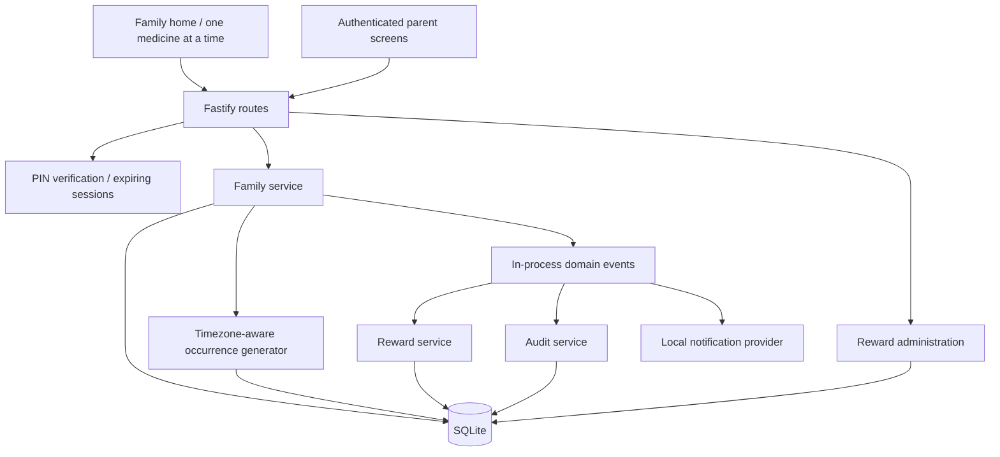
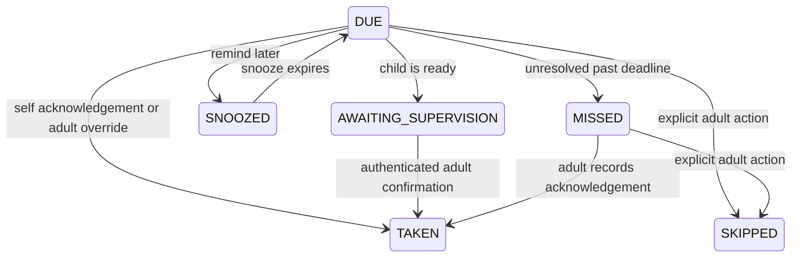

# Architecture

## Boundaries

`apps/web` contains the touchscreen kiosk, guided setup, and parent interface. `apps/api` contains Fastify routes, authentication, domain services, and the scheduler. `packages/shared` defines validated inputs and transport types. `packages/database` holds typed tables, migrations, and the database connection. `packages/integrations` defines reward, calendar, and notification provider contracts, plus local adapters.

## Stored records

Households, users, medications, schedules, schedule weekdays, dose events, reward events, reward definitions, reward settings, devices, sessions, authentication attempts, and audit events have explicit tables. Weekdays use a normalized association table. Free-form JSON is limited to administrative audit metadata.

Dose events have a unique schedule/time key. They retain the display label, dose text, instructions, supervision requirement, grace period, and named period used when generated. Editing a medication does not rewrite that history. Dose state changes update the occurrence and append audit records. Rewards are immutable transactions with unique source keys; the cached point balance changes in the same transaction.

## Scheduling

The adult selects an explicit wall-clock time, named period, weekdays, start date, end date, and grace period. The saved household IANA timezone controls conversion to UTC. No dose calculations or medical decisions are made.

The generator runs every 15 seconds and before relevant reads/actions. It creates occurrences through tomorrow. A persistent cursor catches up after outages in batches of at most 366 calendar days per schedule. Initial schedules begin no earlier than their creation day. A uniqueness constraint makes regeneration safe.

During a spring-forward gap, the selected time advances to the next valid local time. During a repeated hour, one occurrence uses the first matching instant. Tests cover both cases. Review these explicit rules with the adult configuring the schedule.

A dose is overdue after its configured grace period. An unresolved occurrence becomes `MISSED` after the later of its local day's end and grace deadline. Snoozing changes the reminder time, never the scheduled time or prescription. Schedule and medication edits affect tomorrow onward. Today's snapshots remain available to the parent.

Before disabling a medication or schedule, an adult must explicitly resolve its pending doses today through History. This avoids silently deciding to skip or continuing to prompt for a disabled medicine. Disabling a person hides their kiosk card and stops new generation; their history remains.

## State and acknowledgement rules

Taken and skipped occurrences are terminal for normal actions. Duplicate completion retries return the stored outcome without repeating points. Early completion is rejected. Adults may explicitly skip an upcoming occurrence. The UI says an acknowledgement was recorded, never that ingestion was medically verified.

The in-process event bus runs reward and audit handlers inside the acknowledgement transaction. Failure rolls back the dose and its awards. Local completion alerts run after commit. Due and overdue alerts are derived from current persisted occurrences. External delivery would need a transactional outbox before being relied on; no external provider is enabled in this MVP.

## Rewards

`RewardService` owns all calculations and ledger credits. Values come from the household reward settings, not dose controllers. Defaults are 2 per medication, 3 for completing all scheduled medicines for a calendar day, 10 at each seven-day streak milestone, and 25 at each thirty-day milestone.

A streak requires consecutive calendar days with at least one scheduled dose and every dose recorded as taken. A gap or incomplete day breaks the completed sequence. Today can remain pending while yesterday's completed streak is displayed. Early bonus awards do not occur while another medication remains incomplete. Changing point settings affects later transactions only.

Redemption and manual adjustments require an adult session and a stable request ID. They check the ledger balance and commit the transaction atomically. Retries cannot charge twice, and the balance cannot become negative. Redeemed rewards remain auditable even if a definition is later changed.

## Household security and privacy

The kiosk is designed for trusted physical household access. Profile names and daily status are visible on its home screen. A profile PIN protects its medication view. Privacy mode substitutes the adult's display name for the underlying medication name. Adults should choose instructions and images suitable for that visibility.

Adult PINs are mandatory; child PINs are optional. PINs use salted scrypt hashes. Random session tokens are stored as HMAC digests in SQLite, expire after 15 minutes, and travel in HttpOnly, SameSite=Strict cookies. PIN failures are limited by IP and by persistent per-account attempt records. Role checks run on the API, including supervision, skipping, administration, and redemption.

Mutation requests need a same-origin verification header and matching Origin/Host when Origin is supplied. No cross-origin API access is enabled. API responses use `Cache-Control: no-store`. Parent access is locked when the kiosk home opens; protected query data is removed from browser memory. Browser device cookies are identifiers, not authentication credentials or proof of who used the screen.

Uploads require an adult. The server accepts JPEG, PNG, and WebP up to 2 MB and 16 million decoded pixels, strips metadata, and stores a resized WebP under a random filename. Images are served with a fixed MIME type and `nosniff`, subject to profile access. SVG and undecodable content are rejected.

SQLite is local but not encrypted by this application. Use host disk encryption, restricted filesystem access, and private backups. HTTPS is required for remote tablet installation and secure cookies. This is household software, not a hospital EMR or a publicly exposed service.

## Offline operation and devices

Core operation depends on the local server and SQLite, not the Internet. The PWA caches static assets only. API responses, medication history, and acknowledgement requests never enter the service-worker cache. A disconnected tablet shows a connection error and cannot claim successful recording. It does not independently act as a second database.

A kiosk connection registers or refreshes a `WEB` device ID. Dose events retain that ID when available. Hardware categories are descriptive only and do not alter business rules. Future Android wrappers, Raspberry Pi kiosks, and commercial devices can use the same contracts.

## Deferred capabilities

Not implemented: cloud sync, multiple households, remote parent app, Skylight integration, Google Calendar, Apple integration, hosted SaaS, Android native wrapper, dedicated commercial hardware, automatic updates, device enrollment approval, fleet management, or subscription billing. Provider interfaces reserve a place for future work without adding cloud infrastructure to the local runtime.

## Optional background reminders

Web Push subscriptions and VAPID keys persist in SQLite. The scheduler sends generic reminders for due, overdue, and awaiting-adult states. Delivery records suppress repeats, temporary failures back off, and expired subscriptions are removed. Background push requires Internet access. The family home screen can also display local alerts and play optional chimes.
